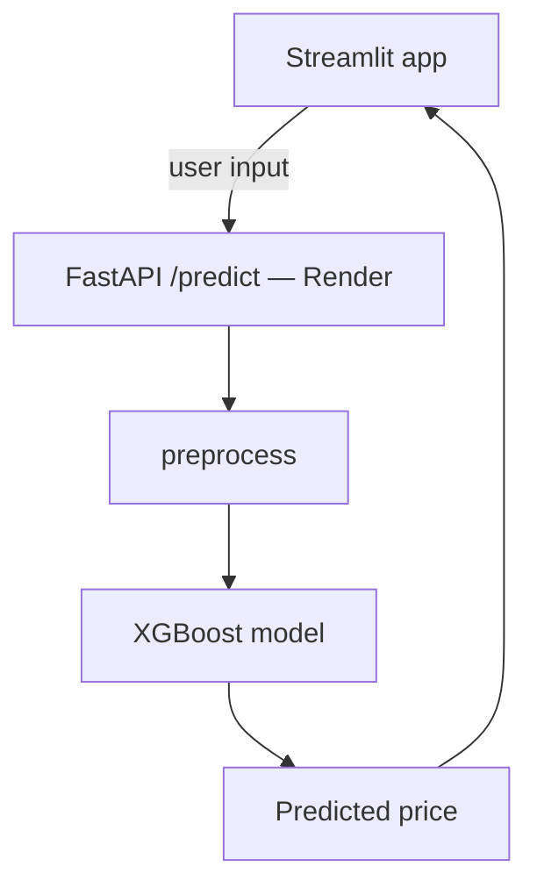

# Immo Eliza Deployment
[](https://www.python.org/)
[](https://fastapi.tiangolo.com/)
[](https://streamlit.io/)
[](https://render.com/)

## 📑 Contents
- [Description](#-description)
- [Repo structure](#-repo-structure)
- [Architecture](#-architecture-overview)
- [Design notes](#️-design-notes)
- [Usage](#-usage)
- [Possible improvements](#-possible-improvements)
- [Timeline](#️-timeline)
- [Personal situation](#-personal-situation)

## 📖 Description

**Immo Eliza Deployment** takes the regression model built in the previous [Immo Eliza ML](https://github.com/guigallent/immo-eliza-ml) project and turns it into an app non-technical people can actually use. The goal was to wrap the trained XGBoost model in a `FastAPI` service, deploy it publicly, and build a `Streamlit` front-end on top of it so that anyone can get a price estimate for a Belgian property.

This is the fourth project in the Immo Eliza series, following a [scraping project](https://github.com/guigallent/immo-eliza-scraping), a [data-analysis project](https://github.com/guigallent/immo-eliza-chameleon-analysis), and the [machine learning project](https://github.com/guigallent/immo-eliza-ml).

During this project, I:

- Wrapped the trained XGBoost model and its preprocessing artifacts in a `predict()` function that takes raw property data and returns a price.
- Built a FastAPI application exposing a `GET /` health check route and a `POST /predict` route, with a `PropertyData` schema using `Pydantic` defining every required and optional input field.
- Containerized the API with a Dockerfile and deployed it on **Render**.
- Built a **Streamlit** front-end that sends requests to the deployed API and displays the predicted price back to the user.
- Worked through a few Streamlit-specific quirks (see below) to keep the form simple and reliable for non-technical users.


## 📦 Repo structure

```
immo-eliza-deployment/
├── api/
│   ├── artifacts/
│   │   ├── preprocessor.joblib
│   │   └── zipcode_belgium.csv
│   ├── model/
│   │   └── xgboost.joblib
│   ├── src/
│   │   └── preprocess.py
│   ├── app.py
│   ├── Dockerfile
│   ├── geo.py
│   ├── logger.py
│   ├── predict.py
│   └── schemas.py
├── streamlit/
│   ├── app.py
├── .gitignore
├── README.md
└── requirements.txt
```

### 🧩 Project modules

- `api/src/preprocess.py` reproduces the feature engineering and encoding logic from the ML project (one-hot and ordinal encodings, EPC score conversion). For the correct deployment of the regression model in this project, some tweaks were required, encapsulating the script into the `PropertyPreprocessor` class.
- `api/predict.py` loads the trained XGBoost model and preprocessing artifacts, and defines the `predict()` function that takes a property's data to return its estimated price.
- `api/app.py` is the FastAPI application. It includes a `GET /` route for a basic health check, and a `POST /predict` route that accepts a `PropertyData` JSON payload and returns a predicted price.
- `api/Dockerfile` packages the API and its dependencies into an image in order to consequently deploy it on Render.
- `streamlit/app.py` is the front-end. It creates a single form covering all `PropertyData` fields, which sends a request to the deployed API and displays the prediction.


## 🔀 Architecture overview



The API can be used directly by developers, while the Streamlit app is a friendlier layer for non-technical users to interact with the API.


## 🎛️ Design notes

### API

Code for the API has kept a modular design to separate different functionalities. A couple of design decisions worth flagging:

- **Location input**: the deployed ML model only takes ***latitude/longitude*** coordinates as geographical input. However, they are not very convenient for most users to provide. Therefore, the `geo.py` module allows users to enter a ***zip code*** instead, which is converted into coordinates using equivalences from [this GitHub repository](https://github.com/jief/zipcode-belgium). The zip code (or the coordinates directly, if provided) also determines the property's ***province***, which is needed to apply the correct EPC-to-kWh/m² per year conversion table (Brussels, Flanders, and Wallonia each use different scales, as established in the previous ML project). If a user provides both a location and an explicit province, `predict.py` cross-checks the two and rejects the request if they don't match, rather than silently trusting one over the other. The user can set `province` to `"not_specified"` to have it inferred automatically instead.

- **Use of `logging`**: `logger.py` configures a logger that both `app.py` and `predict.py` use to track health checks, incoming prediction requests, and errors. While this is not exposed to end users through the API or Streamlit app, it makes it easier for developers to trace what went wrong, either in the terminal during local development or in Render's log viewer once deployed.

### Streamlit

The form's design is deliberately kept with a minimalistic design and attempts to follow a ***consistent UI/UX*** approach that makes it user-friendly. Inputs are split into three main blocks (property, location, and extra details) and optional fields are properly indicated. 

For ***location***, it follows the API's approach and allows the user to enter either latitude/longitude or zip code. Originally, the idea was to include a toggle between these two. However, this ran into a Streamlit limitation. Widgets inside an `st.form` only rerun on submit, not on interaction, so a toggle inside the form could not dynamically show or hide fields. Rather than moving the section outside of the form and losing the intended layout, the toggle was dropped and all location fields are shown at once.

## 📌 Usage

You can either access both the API and the Streamlit application online or reproduce them on your machine.

### Option A: access online

| | Link |
|---|---|
| 🔌 API | [immo-eliza-deployment-jsgk.onrender.com](https://immo-eliza-deployment-jsgk.onrender.com/) |
| 📄 API docs | [immo-eliza-deployment-jsgk.onrender.com/docs](https://immo-eliza-deployment-jsgk.onrender.com/docs) |
| 🖥️ Streamlit app | [immo-eliza-deployment-guigallent.streamlit.app](https://immo-eliza-deployment-guigallent.streamlit.app) |

> ⚠️ **Note:** the first prediction can take up to 30 seconds while the API wakes up.

### Option B: reproduce locally

1. Clone the repository to your local machine.

2. Create and activate a virtual environment, and install `requirements.txt`.

3. **API**
   - Run `app.py` locally with `uvicorn app:app --reload`, or build and run the Docker image.
   - Visit `/docs` for the auto-generated FastAPI documentation.

4. **Streamlit app**
   - _(Optional)_ Update `API_URL` in `app.py` to point to your locally running API. If you omit this step, the API deployed on render.com will be used.
   - Run `streamlit run app.py` and fill in the form to get a price prediction.

## 🔧 Possible improvements

- **Include city name** as a location input. This is a user-friendly field that could improve user experience, especially for the Streamlit app. Due to linguistic issues (Belgian municipalities oftentimes have different names in French, Dutch, and English) and time constraints, this improvement was dropped in favour of postal code.
- **Integrate zip code data directly into the code** rather than reading `zipcode_belgium.csv` on every request. Beyond improving response efficiency, this would allow the Streamlit form to validate that a zip code actually exists (not just that it's 4 digits) before sending the request, replacing the current API-level error — e.g. entering `1001` currently fails with `Could not resolve location for zip_code='1001'` from the API, rather than a clearer, immediate message on the form itself.


## ⏱️ Timeline

This project took five days for completion.


## 📌 Personal Situation

This project was done as part of the AI & Data Science Bootcamp at BeCode, as a solo project. It is the fourth stage of the Immo Eliza pipeline, following a property-scraping project, a data-analysis/visualization project, and the ML pipeline project, all available on my profile.

👥 Connect with me:
- [LinkedIn - Guillermo Gallent Lloria](https://www.linkedin.com/in/guillermo-gallent/)
